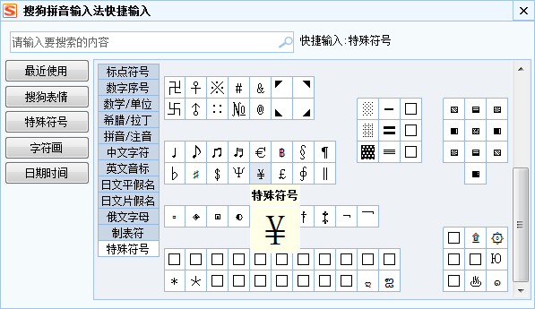

## 人民币符号￥，到底该一横还是两横？
1. 首先如果不使用转义，直接用输入法切换中文字符输入则输出￥，是四个字节的中文。
   如果使用英文输入法输入2个字节的?如图
   
   ，那么显示的跟font-family有一定关系，会出现编译器显示一横，但是页面显示两横的情况。
   这种情况原因是IDE的字体与body字体font-family不同导致。
2. 为了解决这种问题，我们采用转义方式，目前有三种转义 &yen; &#0165; &#65509;前两种仔细看是一样的，因为他们基于日文的一个符号?，
而后者是基于用中文输入法输入的￥。因此我们用到转义，而不能用输入法直接输入。最好用后者。
3. 结论?与￥在浏览器上存在如下差异
    1. 前者两字节，后者4字节。
    2. 前者后者在使用微软雅黑字体的情况下显示都是两横正常，但是如果后者在并非采用微软雅黑字体的环境下(font-family: "Helvetica Neue")，
    他们会显示出他原本的模样 ?与￥。
    如图
    。
    3.  &yen; &#0165;都是?的转义，然而&#65509;是中文输入法中4字节的￥。
    4. 正确的人民币符号应该是：Y＋＝ 这个才对 ,因为它就是人民币单位元的汉语拼音声母Y 再加上 等于＝ 合成而成。
    参考大学会计专业的《金融学》书。因此应该选择类似于Y的后者。
   